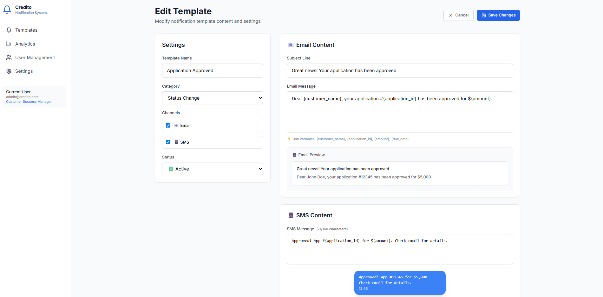

# Credito Notification Management System

A modern React-based notification management system for automated customer communications, built according to the Product Requirements Document for Credito's mortgage application process.

## Assignment Overview

This project is a frontend implementation of a notification management system that allows Credito staff to independently manage automated customer notifications without developer dependency. The system handles notifications for status changes, document requests, and payment due scenarios across email and SMS channels.

## Features

- **Dashboard View**: Overview of all notification templates with statistics
- **Template Management**: Create, edit, and manage notification templates
- **Multi-Channel Support**: Email and SMS notification channels
- **Category Organization**: Templates organized by Status Change, Document Request, and Payment Due
- **Real-time Preview**: Live preview of template content with sample data
- **Search & Filter**: Find templates quickly with search and category filters
- **User Role Management**: Role-based access control simulation
- **Modern UI**: Clean, responsive design using Tailwind CSS

## Images





## Technology Stack

- **React 18.3.1** - Modern React with hooks
- **Vite 6.0.1** - Fast build tool and development server
- **Tailwind CSS 3.4.17** - Utility-first CSS framework
- **Lucide React** - Beautiful icon library
- **Inter Font** - Modern, readable typography

## Getting Started

### 1. Clone the Repository

```bash
git clone https://github.com/yafitAvazov/credito-demo.git
cd credito-demo
```

### 2. Install Dependencies

```bash
npm install
```

### 3. Start Development Server

```bash
npm run dev
```
The application will be available at `http://localhost:5173`


## Features Implemented

✅ Template CRUD operations  
✅ Multi-channel support (Email/SMS)  
✅ Category-based organization  
✅ Real-time preview  
✅ Search and filtering  
✅ Responsive design  
✅ Modern React patterns  


## Future Enhancements

- TypeScript integration
- React Router for navigation
- State management with Zustand/Redux
- API integration
- Real-time notifications
- Advanced analytics
- A/B testing framework
- Multi-language support


